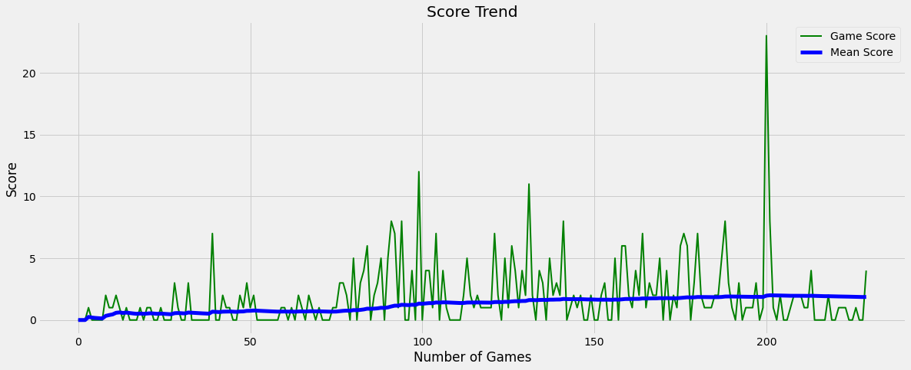

# 🐍 Retro Snake Game

Snake is an artificial intelligence that learns to control a snake. This AI learns to recognize its environment and choose the best direction to survive. Policy gradient and deep Q learning algorithms (implemented with TensorFlow and Keras) are used to train an agent to play the game. The neural network configuration can be saved as a .h5 file.

## What is Deep Q-Learning

Deep Q-Learning is a type of reinforcement learning algorithm that uses a deep neural network to approximate the Q-function, which is used to determine the optimal action to take in a given state. For every move, the game will send a reward. If the snake collides with itself or a wall, there is a negative reward. If the snake eats the food, there is a positive reward.

The Q matrix is initially filled with zeros. The size is (number of states, number of actions). Every move that the agent makes, the Q table is updated as below:

    Q[state, action] = reward + gamma * max(Q[new_state, :])

During the training phase, the agent will either choose the action with the max Q value at that state or the agent will randomly choose an action. The Q matrix is then updated using the equation above. This process is repeated until the game is complete. Many games are played to update the Q matrix.

## Getting Started

### Clone

To install, clone this repository to your local machine `git clone https://github.com/darthdaenerys/Little-Big-Snake.git`

Change to clone directory `cd Little-Big-Snake`

Install necessary requirements `pip install -r requirements.txt` or in case you get an error try using `pip install numpy pandas pygame tensorflow matplotlib`

If you ever need to remove a module for any reason, use the command `pip uninstall <module-name>`

### Usage

- Run the `main_self.py` file to control the snake with keyboard.
- Run the `main_ai.py` file to let AI control the snake.

## Instructions

- The snake can move in 4 directions.
- The snake is bounded in all the directions and dies if it goes outside the screen.
- The snake dies if either it collides with the wall or itself.
- The objective for the snake is to eat as many food as possible.
- Feeding the snake increases its length and the score.

### Key Controls

| Action | Primary | Secondary |
| :-: | :-: | :-: |
|Move up| `W` |`up arrow`|
|Move down| `S`|`down arrow`|
|Move left|`A`|`left arrow`|
|Move right|`D`|`right arrow`|
|Pause|`P`| |
|Exit|`Close button`|`Q`|

## Snake score over time

## Contributions

Pull requests are welcome. You can submit any request you want, or report any bug you encounter by opening an issue. Feel free to come up with ideas whether it is about coding practices or game mechanics.

Here are some suggestions of contributions:

- Check the opened issues, there are bugs that could be fixed or enhancement waiting for implementation.
- Help with balancing would be greatly appreciated...
- Contributions for sound effects or new soundtracks would be really appreciated.
